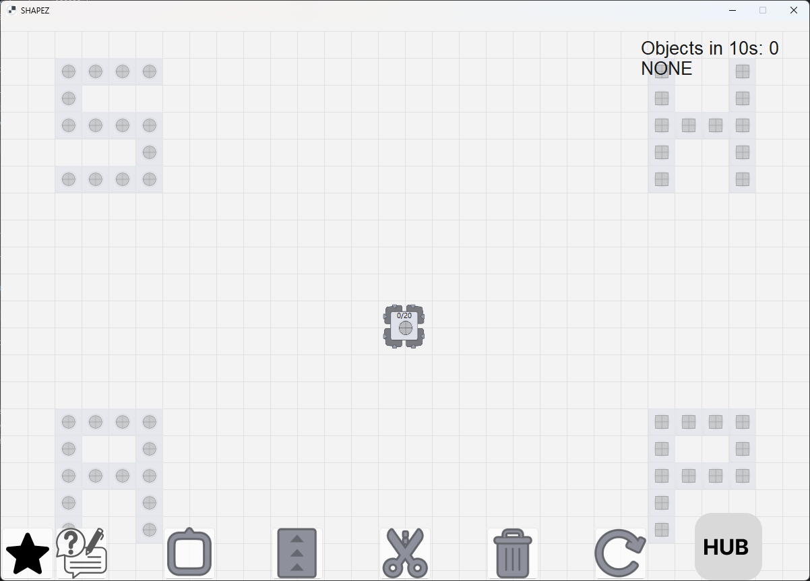
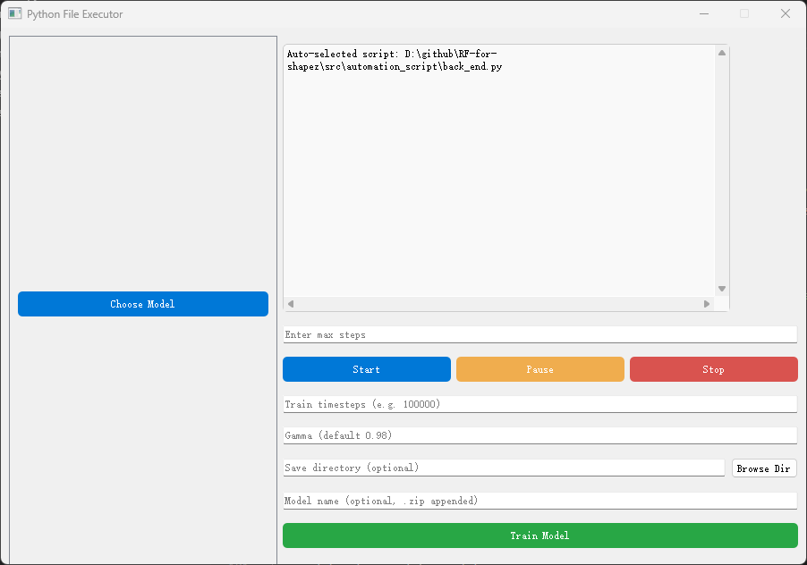

# RF-for-shapez

A reinforcement learning project that uses **PPO (Proximal Policy Optimization)** algorithm to automatically play the **Shapez** game. The AI agent reads game state and automatically plans and places structures such as conveyors, miners, cutters, and trash bins to complete game objectives.





## Features

- 🤖 **PPO Reinforcement Learning**: Uses PPO algorithm implemented with Stable-Baselines3, with action masking to restrict invalid actions
- 🎮 **Game State Reading**: Reads game map, resource grid, target shapes, and other information through shared memory
- 🖥️ **Graphical Interface**: PyQt5 frontend for easy model selection, training, and execution
- 🎯 **Automated Operations**: Uses PyAutoGUI to automatically click and place structures for fully automated gameplay

## Quick Start

### Environment Setup

Conda environment is recommended:

**Option A: Use environment.yml (Recommended)**
```bash
conda env create -f environment.yml
conda activate rf_shapez
```

**Option B: Manual Installation**
```bash
conda create -n rf_shapez python=3.12 -y
conda activate rf_shapez
pip install -e .
```

Main dependencies:
- `torch` - PyTorch deep learning framework
- `stable-baselines3` - Reinforcement learning algorithms library
- `gymnasium` - Reinforcement learning environment interface
- `pyqt5` - GUI interface
- `pyautogui` - Automation operations
- `opencv-python` - Image processing (for screen matching)

### Launch Options

**Option 1: Launch Game and Script Together (Recommended)**
```bash
# Run the packaged executable
src\dist\main.exe
```

**Option 2: Launch Separately**
```bash
# 1. Start the game first
src\shapez\exe\exe\MyShapez.exe

# 2. Then start the script interface (in another terminal)
conda activate rf_shapez
python src\automation_script\front_end.py
```

Or use the Python script to launch both:
```bash
conda activate rf_shapez
python src\main.py
```

## Usage Guide

### 1. Select or Train a Model

After launching the GUI, you have two options:

**Select a Pre-trained Model:**
- Click the **"Choose Model"** button on the left
- Select a `.zip` model file from the `src\ppo_model\trained\` directory
- Click **"Use model"** to set it as the current model

**Train a New Model:**
- Fill in the parameters in the training panel on the right:
  - **Train timesteps**: Number of training steps (e.g., `100000`)
  - **Gamma**: Discount factor (default `0.98`)
  - **Save directory**: Save directory (optional, defaults to `src\ppo_model\trained`)
  - **Model name**: Model name (optional, `.zip` extension will be added automatically)
- Click **"Train Model"** to start training
- After training completes, the model will be saved automatically, then select it for use

### 2. Run the Automation Script

1. Make sure the game is launched and running in windowed mode (recommended window size around 1200x830)
2. After selecting a model in the GUI, click the **"Start"** button
3. The AI will automatically read the game state, plan, and execute actions
4. You can use **"Pause"** to pause execution, or **"Stop"** to stop execution

## Project Structure

```
src/
├── automation_script/
│   ├── front_end.py          # PyQt5 GUI interface
│   ├── back_end.py            # Automation logic (PyAutoGUI)
│   └── *.png                  # Toolbar icons (for screen matching)
├── ppo_model/
│   ├── PPO.py                 # PPO model loading and training logic
│   ├── ShapezEnv.py          # Custom Gymnasium environment
│   ├── getmap.py              # Read game state from shared memory
│   └── trained/               # Trained models directory
│       └── *.zip              # PPO model files
├── shapez/
│   └── exe/exe/
│       └── MyShapez.exe       # Game executable
└── main.py                    # Launch script (launches both game and GUI)
```

## Technical Details

### Game State Reading

The project reads the following information through Windows shared memory:
- `SharedResource`: Resource grid (20x32 int32)
- `SharedBuild`: Building grid (20x32 int32)
- `need_shape_name`: Target shape ID
- `scrolloffset`: Scroll offset
- `scaleFactor`: UI scale factor

### PPO Algorithm

- Uses **MaskedMultiInputPolicy** to restrict invalid actions
- Action space includes: placing conveyors, miners, cutters, trash bins, etc.
- Observation space includes: resource grid, building grid, target shape, etc.

### Automation Operations

- Uses PyAutoGUI for screen matching and mouse operations
- Identifies and clicks toolbar buttons through icon recognition
- Automatically places buildings based on grid coordinates

## FAQ

**Q: Game executable not found?**
- Make sure `MyShapez.exe` is located in `src\shapez\exe\exe\` directory
- Or modify the `game_exe` path in `src\main.py`

**Q: Shared memory read failed?**
- Make sure the game is launched and running
- Check if the game version supports the shared memory interface

**Q: Toolbar icon recognition failed?**
- Make sure the game UI theme and scale match the icons in `src\automation_script\*.png`
- If the UI theme is different, you need to replace the corresponding PNG files

**Q: Model loading failed?**
- Make sure you selected a valid `.zip` model file
- Check if PyTorch and Stable-Baselines3 versions are compatible
- If versions don't match, retrain a model

**Q: Windows only?**
- Yes, the project relies on Windows API, shared memory, and desktop automation features, currently only supports Windows platform

## Development Notes

- Change game path: Edit the `game_exe` variable in `src\main.py`
- Adjust window/grid parameters: Modify window size and `cell_size` calculation in `src\automation_script\back_end.py`
- Minimum dependencies: `gymnasium`, `numpy`, `pyqt5`, `pyautogui`, `stable-baselines3`, `torch`, `opencv-python`, `pillow`

## License

This project is for learning and research purposes only.
